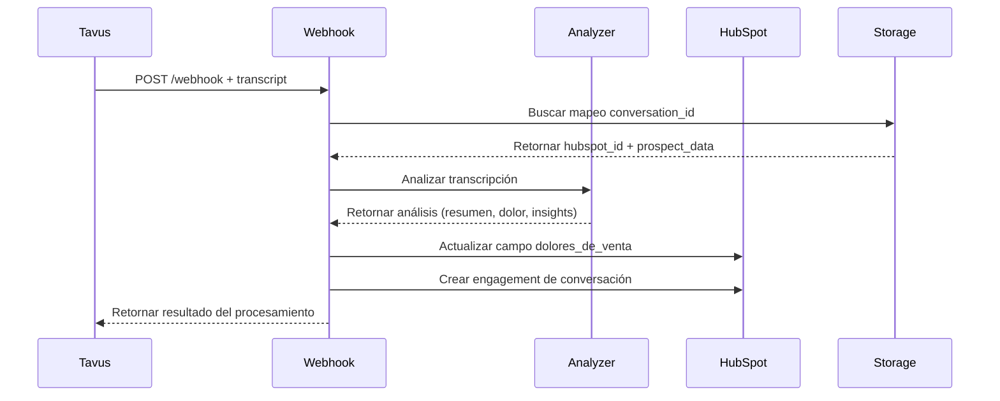

# Sistema de Análisis de Conversaciones con IA

## Descripción

Sistema automatizado que utiliza LangChain y OpenAI para analizar transcripciones de conversaciones de ventas, extraer información clave y actualizar automáticamente campos en HubSpot CRM.

## Arquitectura

### Componentes Principales

1. **ConversationAnalyzer** (`agents/conversation_analyzer.py`)
   - Agente LangChain para análisis de transcripciones
   - Extracción de resumen, dolor del cliente e insights
   - Mapeo de dolores a valores específicos de HubSpot

2. **HubSpot Fields Manager** (`api/hubspot_fields.py`)
   - Gestión del campo personalizado `dolores_de_venta`
   - Validación de valores permitidos
   - Actualización de contactos en HubSpot

3. **Webhook Handler** (`app.py`)
   - Procesamiento de transcripciones desde webhook
   - Integración con sistema de almacenamiento
   - Creación automática de engagements

## Flujo de Procesamiento



## Dolores de Venta Identificables

El sistema puede identificar y mapear los siguientes dolores específicos:

1. **"No se en que invierte el tiempo mis vendedores"**
2. **"No tengo CRM o siento que no lo aprovecho lo suficiente"**
3. **"El seguimiento a los prospectos y negocios es minimo"**
4. **"El equipo de ventas gasta mucho tiempo en actividades operativas"**
5. **"Mi nivel de recompra es muy bajo"**
6. **"Los negocios que generamos son muy pocos"**

## Formato de Transcripción

### Estructura de Entrada

```json
{
  "replica_id": "r92debe21318",
  "transcript": [
    {
      "role": "system",
      "content": "Contexto del sistema..."
    },
    {
      "role": "assistant", 
      "content": "Respuesta del agente Wayne..."
    },
    {
      "role": "user",
      "content": "Mensaje del prospecto..."
    }
  ]
}
```

### Análisis de Salida

```json
{
  "summary": "Resumen ejecutivo de la conversación...",
  "pain_point": "No tengo CRM o siento que no lo aprovecho lo suficiente",
  "pain_confidence": 0.85,
  "key_insights": [
    "Prospecto interesado en optimización de procesos",
    "Empresa en etapa de crecimiento"
  ],
  "next_steps": "Agendar reunión de calificación...",
  "qualification_score": 8
}
```

## API Endpoints

### Webhook de Transcripción

**Endpoint**: `POST /webhook`

**Request Body**:
```json
{
  "replica_id": "r92debe21318",
  "transcript": [...]
}
```

**Response** (Éxito):
```json
{
  "status": "success",
  "message": "Conversación procesada exitosamente",
  "conversation_id": "r92debe21318",
  "hubspot_id": "hubspot-12345",
  "analysis": {
    "summary": "Resumen de la conversación...",
    "pain_point": "No tengo CRM o siento que no lo aprovecho lo suficiente",
    "pain_confidence": 0.85,
    "qualification_score": 8,
    "key_insights": [...],
    "next_steps": "..."
  },
  "updates": {
    "pain_field_updated": true,
    "engagement_created": true
  }
}
```

## Configuración

### Variables de Entorno

```bash
# OpenAI para análisis de IA
OPENAI_API_KEY=sk-...

# HubSpot para actualizaciones
HUBSPOT_API_KEY=pat-...
HUBSPOT_PORTAL_ID=...
```

### Instalación de Dependencias

```bash
pip install langchain==0.1.0
pip install langchain-openai==0.0.5
pip install openai==1.6.1
```

## Análisis Inteligente

### Proceso de Análisis

1. **Extracción de Contexto**: Identifica empresa, rol y datos del prospecto
2. **Análisis de Conversación**: Utiliza GPT-4 para analizar la transcripción
3. **Identificación de Dolor**: Mapea el dolor principal a categorías predefinidas
4. **Puntuación de Calificación**: Asigna score de 1-10 basado en criterios BANT/MEDDIC
5. **Extracción de Insights**: Identifica puntos clave y próximos pasos

### Criterios de Calificación

- **Presupuesto**: Evidencia de capacidad de inversión
- **Autoridad**: Nivel de toma de decisiones
- **Necesidad**: Claridad del problema a resolver
- **Timeline**: Urgencia para implementar solución

### Modo de Simulación

Si no se configura `OPENAI_API_KEY`, el sistema opera en modo simulación:
- Análisis basado en palabras clave
- Mapeo básico de dolores
- Respuestas predefinidas

## Engagement en HubSpot

### Tipo de Engagement Creado

**Llamada (CALL)**
- Duración estimada
- Estado: COMPLETED
- Dirección: OUTBOUND
- Incluye metadata completa:
  - Transcripción de la conversación
  - Resumen ejecutivo
  - Insights clave
  - Próximos pasos
  - Puntuación de calificación
  - Información del dolor identificado
  - Datos del contacto y empresa

### Metadata de la Llamada

La llamada creada en HubSpot incluye toda la información de la conversación en sus metadatos:

```json
{
  "title": "Conversación con [Nombre] [Apellido]",
  "durationMilliseconds": 1800000,
  "state": "COMPLETED",
  "direction": "OUTBOUND",
  "disposition": "COMPLETED",
  "transcript": "Transcripción completa de la conversación...",
  "summary": "Resumen ejecutivo generado por IA...",
  "painPoints": ["Dolor identificado por el análisis"],
  "keyInsights": ["Insight 1", "Insight 2", "Insight 3"],
  "nextSteps": "Próximos pasos recomendados...",
  "qualificationScore": 8,
  "company": "Nombre de la empresa",
  "jobTitle": "Cargo del contacto",
  "conversationId": "ID de la conversación",
  "aiAgent": "Wayne (SDR Triario)"
}
```

## Pruebas

### Ejecutar Pruebas del Sistema

```bash
cd backend
python test_transcript_webhook.py
```

### Pruebas Manuales

1. **Crear mapeo de prueba**:
```python
from storage.conversation_storage import conversation_storage

conversation_storage.store_mapping(
    conversation_id="test-123",
    hubspot_id="hubspot-456", 
    prospect_data={...}
)
```

2. **Enviar webhook de prueba**:
```bash
curl -X POST http://localhost:5003/webhook \
  -H "Content-Type: application/json" \
  -d '{"replica_id": "test-123", "transcript": [...]}'
```

## Monitoreo y Logs

### Logs Importantes

- `🎙️ Procesando transcripción de conversación`
- `🤖 Iniciando análisis de transcripción con IA`
- `📝 Actualizando campo dolores_de_venta`
- `📞 Creando engagement de conversación en HubSpot`
- `✅ Conversación procesada exitosamente`

### Métricas a Monitorear

- Tiempo de procesamiento de transcripciones
- Tasa de éxito en identificación de dolores
- Puntuaciones promedio de calificación
- Número de engagements creados

## Troubleshooting

### Problemas Comunes

1. **Error de API Key de OpenAI**
   - Verificar variable `OPENAI_API_KEY`
   - Sistema funciona en modo simulación

2. **Mapeo no encontrado**
   - Verificar que el prospecto se haya registrado
   - Comprobar `conversation_id` en almacenamiento

3. **Error en HubSpot**
   - Verificar permisos de API
   - Comprobar campo `dolores_de_venta` existe

4. **Análisis de baja calidad**
   - Revisar formato de transcripción
   - Ajustar prompt template si es necesario

### Logs de Depuración

```python
import logging
logging.basicConfig(level=logging.DEBUG)
```

## Mejoras Futuras

### Funcionalidades Adicionales

1. **Análisis de Sentimiento**: Evaluar tono y emociones
2. **Detección de Objeciones**: Identificar y categorizar objeciones
3. **Predicción de Cierre**: Score de probabilidad de venta
4. **Análisis de Competencia**: Identificar menciones de competidores
5. **Optimización de Prompts**: A/B testing de prompts

### Integraciones Adicionales

1. **Slack Notifications**: Alertas en tiempo real
2. **Dashboard Analytics**: Métricas de conversaciones
3. **CRM Adicionales**: Salesforce, Pipedrive
4. **Email Automation**: Seguimiento automático

---

**Última actualización**: 6 de octubre de 2025  
**Versión**: 1.0.0
