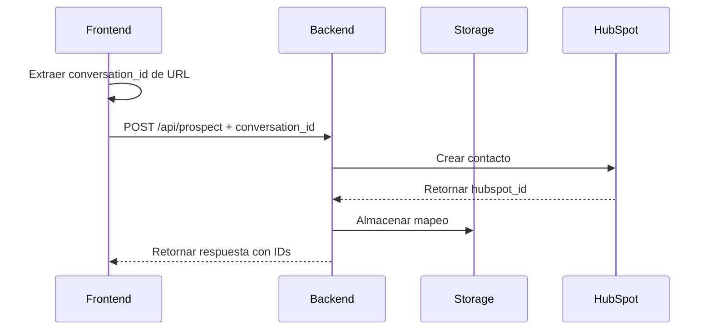

# Sistema de Almacenamiento de Conversaciones

## Descripción

Este sistema permite almacenar y consultar el mapeo entre `conversation_id` (ID de la conversación de Tavus) y `hubspot_id` (ID del contacto en HubSpot CRM). Esto facilita la consulta posterior de información relacionada con conversaciones específicas.

## Arquitectura

### Componentes

1. **ConversationStorage** (`storage/conversation_storage.py`)
   - Clase principal para manejar el almacenamiento
   - Persistencia en archivo JSON
   - Operaciones CRUD completas

2. **Endpoints REST** (`app.py`)
   - `/api/conversation/<conversation_id>` - Consulta completa
   - `/api/conversation/<conversation_id>/hubspot` - Solo hubspot_id
   - `/api/conversations` - Listado de todas las conversaciones

3. **Integración Frontend** (`my-tavus-app/src/`)
   - Envío automático de `conversation_id` al crear prospectos
   - Extracción del ID desde la URL de la conversación

## Flujo de Datos



## Estructura de Datos

### Almacenamiento Interno

```json
{
  "conversation-12345": {
    "conversation_id": "conversation-12345",
    "hubspot_id": "hubspot-67890",
    "prospect_data": {
      "nombres": "Juan",
      "apellidos": "Pérez",
      "compania": "Empresa Demo",
      "websiteUrl": "https://empresademo.com",
      "emailCorporativo": "juan.perez@empresademo.com",
      "rol": "CEO"
    },
    "created_at": "2025-10-06T11:24:26.974800",
    "updated_at": "2025-10-06T11:24:26.974963"
  }
}
```

### Ubicación del Archivo

- **Archivo**: `backend/data/conversation_mappings.json`
- **Formato**: JSON con codificación UTF-8
- **Backup**: Se recomienda hacer respaldos periódicos

## API Endpoints

### 1. Crear Prospecto (Modificado)

**Endpoint**: `POST /api/prospect`

**Request Body**:
```json
{
  "nombres": "Juan",
  "apellidos": "Pérez",
  "compania": "Empresa Demo",
  "websiteUrl": "https://empresademo.com",
  "emailCorporativo": "juan.perez@empresademo.com",
  "rol": "CEO",
  "conversation_id": "conversation-12345"
}
```

**Response**:
```json
{
  "status": "success",
  "message": "Prospecto creado exitosamente",
  "hubspot_id": "hubspot-67890",
  "conversation_id": "conversation-12345",
  "prospect_data": { ... }
}
```

### 2. Consultar Mapeo Completo

**Endpoint**: `GET /api/conversation/<conversation_id>`

**Response** (Éxito):
```json
{
  "status": "success",
  "conversation_id": "conversation-12345",
  "mapping": {
    "conversation_id": "conversation-12345",
    "hubspot_id": "hubspot-67890",
    "prospect_data": { ... },
    "created_at": "2025-10-06T11:24:26.974800",
    "updated_at": "2025-10-06T11:24:26.974963"
  }
}
```

**Response** (No encontrado):
```json
{
  "status": "not_found",
  "message": "No se encontró información para conversation_id: conversation-12345",
  "conversation_id": "conversation-12345"
}
```

### 3. Consultar Solo HubSpot ID

**Endpoint**: `GET /api/conversation/<conversation_id>/hubspot`

**Response** (Éxito):
```json
{
  "status": "success",
  "conversation_id": "conversation-12345",
  "hubspot_id": "hubspot-67890"
}
```

### 4. Listar Conversaciones

**Endpoint**: `GET /api/conversations?limit=100`

**Response**:
```json
{
  "status": "success",
  "data": {
    "total_count": 50,
    "returned_count": 10,
    "mappings": {
      "conversation-12345": { ... },
      "conversation-67890": { ... }
    }
  }
}
```

## Uso en el Frontend

### Extracción del Conversation ID

```typescript
// En conversation/index.tsx
const conversationId = useMemo(() => {
  try {
    const url = new URL(conversationUrl);
    const pathParts = url.pathname.split('/');
    return pathParts[pathParts.length - 1];
  } catch (error) {
    console.error('Error al extraer conversation_id:', error);
    return undefined;
  }
}, [conversationUrl]);
```

### Envío al Backend

```typescript
// En handleProspectSubmit
const prospectDataWithConversationId = {
  ...data,
  conversation_id: conversationId
};

const response = await fetch(`${backendUrl}/api/prospect`, {
  method: 'POST',
  headers: {
    'Content-Type': 'application/json',
  },
  body: JSON.stringify(prospectDataWithConversationId)
});
```

## Casos de Uso

### 1. Consulta Posterior de Contacto

```python
# En el backend, obtener hubspot_id desde conversation_id
hubspot_id = conversation_storage.get_hubspot_id(conversation_id)
if hubspot_id:
    # Usar hubspot_id para consultar información adicional
    contact_info = get_contact_info(hubspot_id)
```

### 2. Crear Engagement de Conversación

```python
# Crear engagement en HubSpot usando los IDs almacenados
mapping = conversation_storage.get_mapping(conversation_id)
if mapping:
    hubspot_id = mapping['hubspot_id']
    create_conversation_engagement(hubspot_id, conversation_data)
```

### 3. Análisis de Conversaciones

```python
# Listar todas las conversaciones para análisis
all_conversations = conversation_storage.list_mappings(limit=1000)
for conv_id, mapping in all_conversations['mappings'].items():
    print(f"Conversación {conv_id} -> HubSpot {mapping['hubspot_id']}")
```

## Pruebas

### Ejecutar Pruebas del Sistema

```bash
cd backend
python test_conversation_storage.py
```

### Ejecutar Pruebas de Endpoints

```bash
cd backend
./test_conversation_endpoints.sh
```

**Nota**: Asegúrate de que el servidor backend esté ejecutándose en `localhost:5003` antes de ejecutar las pruebas de endpoints.

## Consideraciones de Seguridad

1. **Acceso al Archivo**: El archivo `conversation_mappings.json` contiene información sensible
2. **Validación**: Todos los inputs son validados antes del almacenamiento
3. **Logs**: Se registran todas las operaciones para auditoría
4. **Backup**: Implementar respaldos periódicos del archivo de datos

## Migración a Base de Datos

El sistema actual usa almacenamiento en archivo JSON, pero puede migrarse fácilmente a una base de datos:

### Opciones de Migración

1. **SQLite**: Para desarrollo y aplicaciones pequeñas
2. **PostgreSQL**: Para producción con alta concurrencia
3. **MongoDB**: Para datos no estructurados

### Estructura de Tabla (SQLite/PostgreSQL)

```sql
CREATE TABLE conversation_mappings (
    id SERIAL PRIMARY KEY,
    conversation_id VARCHAR(255) UNIQUE NOT NULL,
    hubspot_id VARCHAR(255) NOT NULL,
    prospect_data JSONB NOT NULL,
    created_at TIMESTAMP DEFAULT CURRENT_TIMESTAMP,
    updated_at TIMESTAMP DEFAULT CURRENT_TIMESTAMP
);

CREATE INDEX idx_conversation_id ON conversation_mappings(conversation_id);
CREATE INDEX idx_hubspot_id ON conversation_mappings(hubspot_id);
```

## Monitoreo y Mantenimiento

### Métricas Importantes

- Número total de mapeos almacenados
- Tasa de éxito en consultas
- Tiempo de respuesta de las operaciones
- Tamaño del archivo de almacenamiento

### Tareas de Mantenimiento

1. **Limpieza**: Eliminar mapeos antiguos o inválidos
2. **Backup**: Respaldos automáticos del archivo de datos
3. **Monitoreo**: Alertas por errores en operaciones
4. **Optimización**: Revisar rendimiento con grandes volúmenes

## Troubleshooting

### Problemas Comunes

1. **Archivo no encontrado**: Verificar permisos del directorio `data/`
2. **Error de JSON**: Validar formato del archivo de almacenamiento
3. **IDs duplicados**: Implementar validación de unicidad
4. **Memoria**: Monitorear uso de memoria con muchos mapeos

### Logs de Depuración

```python
import logging
logging.basicConfig(level=logging.DEBUG)
```

## Roadmap

### Mejoras Futuras

1. **Cache en Memoria**: Para consultas frecuentes
2. **API de Webhooks**: Notificaciones automáticas
3. **Dashboard**: Interfaz web para gestión
4. **Métricas**: Dashboard de analytics
5. **Integración**: APIs adicionales (CRM, Analytics)

---

**Última actualización**: 6 de octubre de 2025  
**Versión**: 1.0.0
