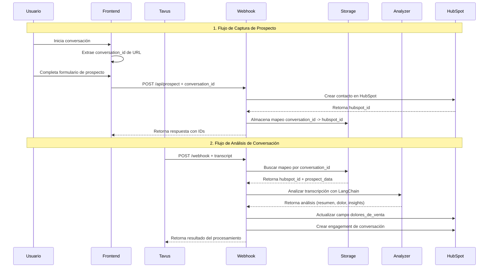

# Arquitectura del Sistema de Análisis de Conversaciones

## Diagrama de Flujo Completo



## Componentes del Sistema

### Frontend (my-tavus-app)
- **Conversation Component**: Extrae conversation_id de URL
- **ProspectForm**: Captura datos del prospecto
- **API Integration**: Envía datos al backend

### Backend (Flask)
- **Webhook Handler**: Procesa transcripciones y tool calls
- **Prospect API**: Crea prospectos en HubSpot
- **Storage API**: Gestiona mapeos conversation_id -> hubspot_id

### Sistema de Almacenamiento
- **ConversationStorage**: Persistencia en archivo JSON
- **Mapeos**: conversation_id -> hubspot_id + prospect_data
- **Ubicación**: `backend/data/conversation_mappings.json`

### Agente de Análisis (LangChain)
- **ConversationAnalyzer**: Análisis de transcripciones con GPT-4
- **Extracción**: Resumen, dolor, insights, puntuación
- **Mapeo**: Dolores a valores específicos de HubSpot

### HubSpot CRM
- **Contactos**: Creación y actualización automática
- **Campo Personalizado**: `dolores_de_venta`
- **Engagements**: Llamadas, notas, tareas de seguimiento

## Flujo de Datos

### 1. Captura Inicial
```
Usuario → Frontend → Backend → HubSpot → Storage
```

### 2. Análisis Post-Conversación
```
Tavus → Webhook → Storage → Analyzer → HubSpot (Campo dolor + Llamada)
```

## Estructura de Archivos

```
backend/
├── agents/
│   └── conversation_analyzer.py      # Agente LangChain
├── api/
│   ├── hubspot.py                    # API HubSpot existente
│   └── hubspot_fields.py            # Gestión campos personalizados
├── storage/
│   └── conversation_storage.py      # Sistema de almacenamiento
├── data/
│   └── conversation_mappings.json   # Datos persistentes
├── app.py                           # Servidor Flask principal
├── requirements.txt                 # Dependencias
└── CONVERSATION_ANALYSIS.md        # Documentación
```

## Endpoints API

### Captura de Prospecto
- `POST /api/prospect` - Crear prospecto con conversation_id

### Consulta de Mapeos
- `GET /api/conversation/<id>` - Mapeo completo
- `GET /api/conversation/<id>/hubspot` - Solo hubspot_id
- `GET /api/conversations` - Lista de conversaciones

### Procesamiento de Conversaciones
- `POST /webhook` - Webhook para transcripciones

## Configuración

### Variables de Entorno
```bash
# OpenAI
OPENAI_API_KEY=sk-...

# HubSpot
HUBSPOT_API_KEY=pat-...
HUBSPOT_PORTAL_ID=...

# Resend
RESEND_API_KEY=...
FROM_EMAIL=...
```

### Dependencias
```bash
langchain==0.1.0
langchain-openai==0.0.5
openai==1.6.1
pydantic==2.5.0
```

## Casos de Uso

### 1. Conversación Nueva
1. Usuario inicia conversación con Tavus
2. Frontend extrae conversation_id
3. Usuario completa formulario
4. Backend crea contacto en HubSpot
5. Se almacena mapeo conversation_id -> hubspot_id

### 2. Análisis Automático
1. Tavus envía transcripción al webhook
2. Sistema busca mapeo por conversation_id
3. LangChain analiza transcripción
4. Se actualiza campo dolores_de_venta
5. Se crea llamada con toda la información en metadata

### 3. Consulta Posterior
1. Backend consulta mapeo por conversation_id
2. Obtiene hubspot_id correspondiente
3. Realiza operaciones en HubSpot
4. Crea engagements adicionales

## Beneficios del Sistema

### Automatización
- ✅ Captura automática de datos de prospectos
- ✅ Análisis inteligente de conversaciones
- ✅ Actualización automática de CRM
- ✅ Creación de llamadas con metadata completa

### Inteligencia
- ✅ Identificación automática de dolores
- ✅ Puntuación de calificación
- ✅ Extracción de insights clave
- ✅ Recomendaciones de próximos pasos

### Trazabilidad
- ✅ Mapeo completo conversation_id -> hubspot_id
- ✅ Historial de conversaciones
- ✅ Auditoría de procesos
- ✅ Consulta posterior de información

## Escalabilidad

### Optimizaciones Futuras
1. **Base de Datos**: Migrar de JSON a PostgreSQL/MongoDB
2. **Cache**: Implementar Redis para consultas frecuentes
3. **Queue**: Usar Celery para procesamiento asíncrono
4. **Monitoring**: Métricas y alertas con Prometheus
5. **API Rate Limiting**: Control de velocidad de requests

### Integraciones Adicionales
1. **Slack**: Notificaciones en tiempo real
2. **Salesforce**: CRM adicional
3. **Zapier**: Automatizaciones
4. **Analytics**: Dashboard de métricas
5. **Email**: Seguimiento automático

---

**Última actualización**: 6 de octubre de 2025  
**Versión**: 1.0.0
